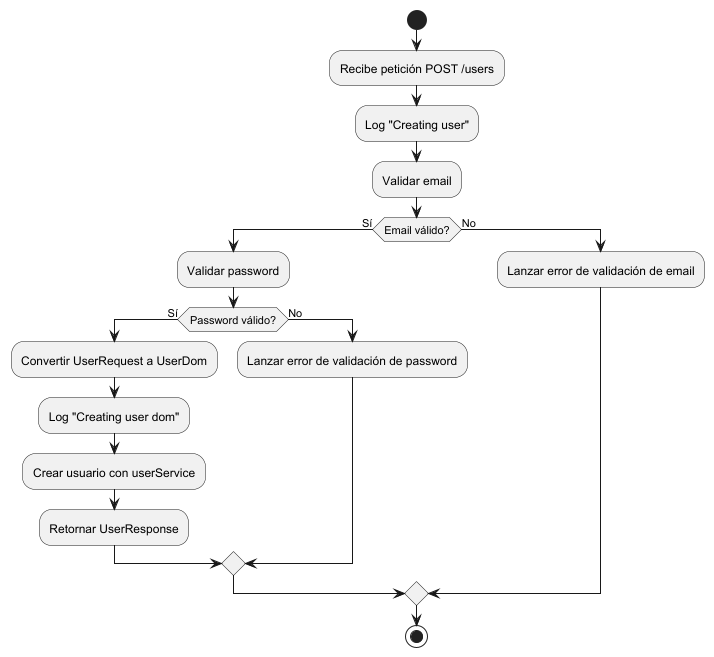
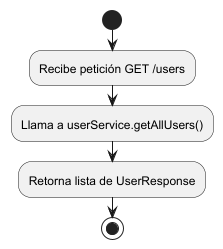
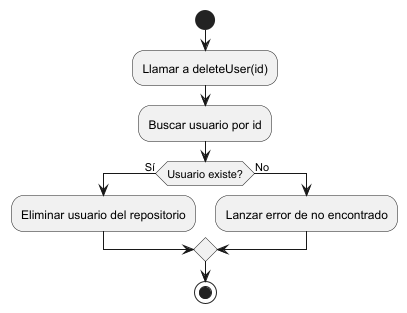

# Evaluación Java Nisum

Aplicación de ejemplo desarrollada con Spring Boot, JPA, H2 y documentación automática de API con Swagger (OpenAPI 3).

## Requisitos

- Java 17
- Gradle
- (Opcional) Postman o similar para pruebas

## Ejecución

1. Clona el repositorio:
   ```sh
   git clone https://github.com/maliaga/evaluacion-java-nisum.git
   cd evaluacion-java-nisum

## Compila y ejecuta la aplicación:

2. Asegúrate de tener Java 17 instalado y configurado en tu PATH.
3. Compila el proyecto:

    ```sh
    ./gradlew bootRun

## Accede a la API en:

[Link Localhost](http://localhost:8080)

## Diagramas






## Documentación Swagger
La documentación interactiva de la API está disponible en:
[Link Swagger](http://localhost:8080/swagger-ui.html)
Desde ahí puedes probar los endpoints y ver los modelos de datos.


##  Base de datos
La aplicación usa H2 en memoria. Accede a la consola en:

[Link a la Base de datos](http://localhost:8080/h2-console)

JDBC URL: jdbc:h2:mem:testdb

Usuario: sa

Contraseña: (dejar en blanco)

## Validaciones

Validar Password: La contraseña debe tener al menos 8 caracteres, una letra mayúscula, una minúscula, un número y un carácter especial.
Ejemplo: `H@hunter2`

Validacion email: El email debe ser válido y único.
Ejemplo formato: `aaaaaaa@dominio.cl`


### Dependencias principales
Spring Boot 3.2.5
springdoc-openapi-starter-webmvc-ui 2.5.0
H2 Database
JJWT

<hr> Desarrollado por [Mario Aliaga].